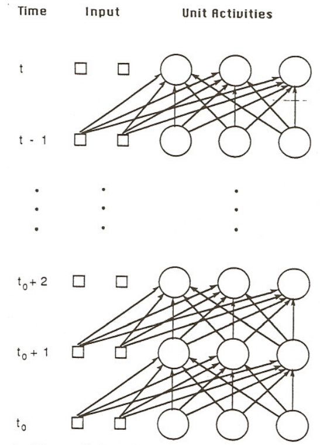
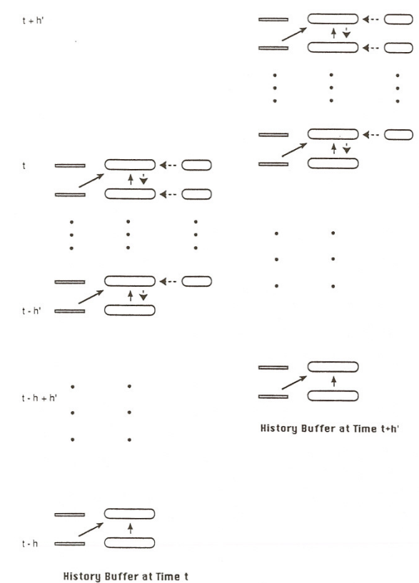
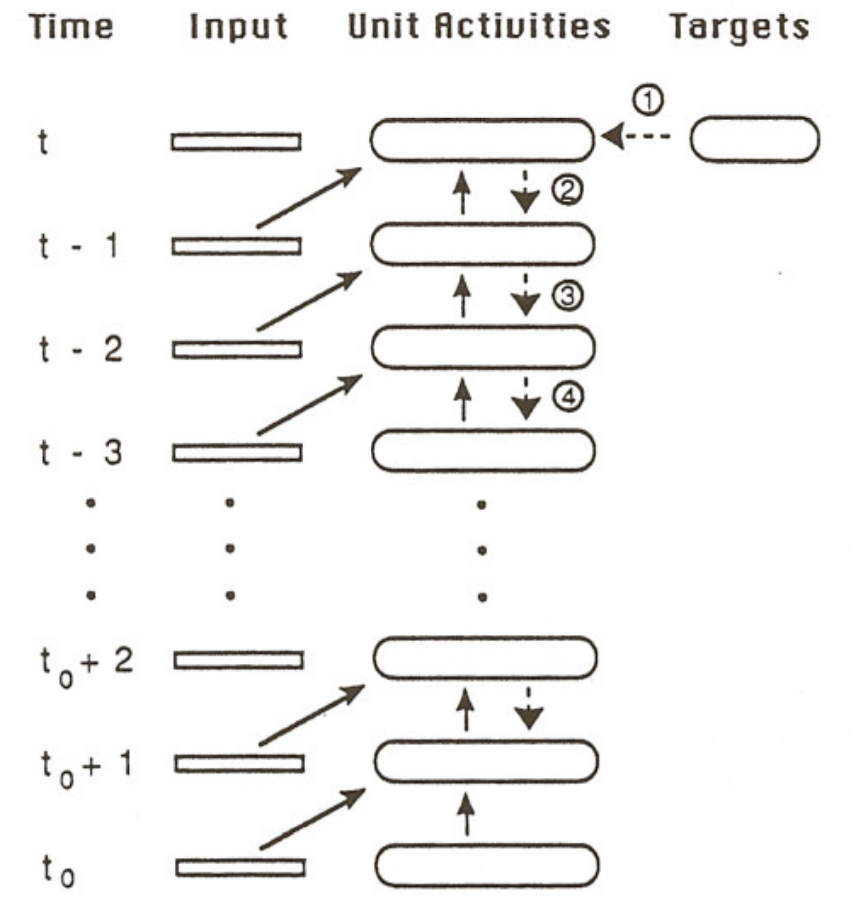
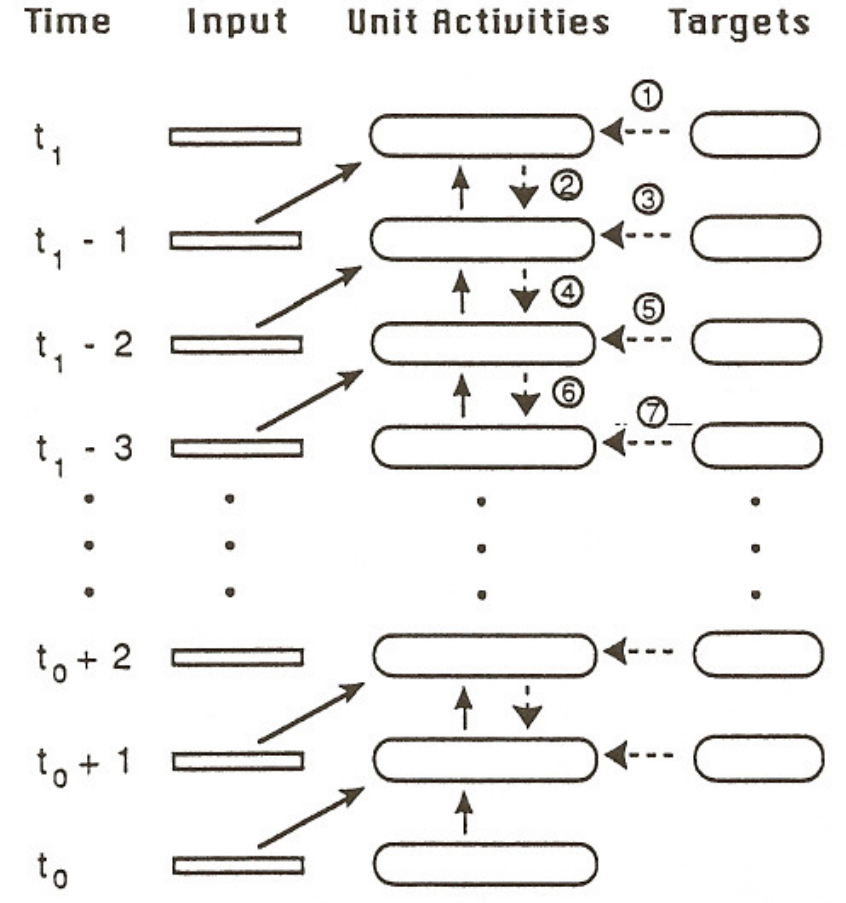
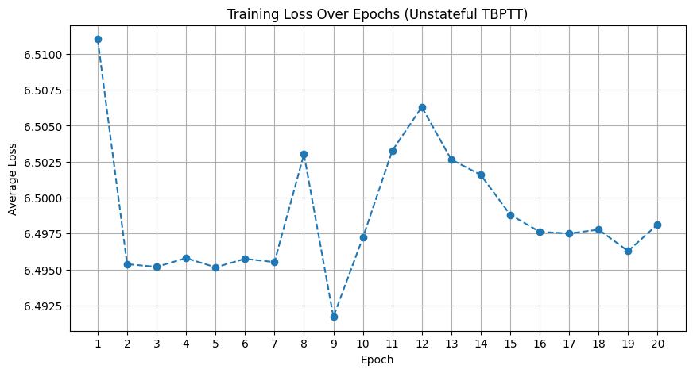
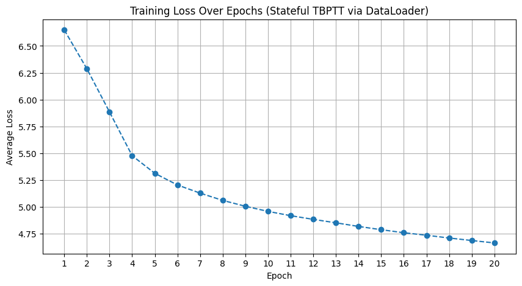
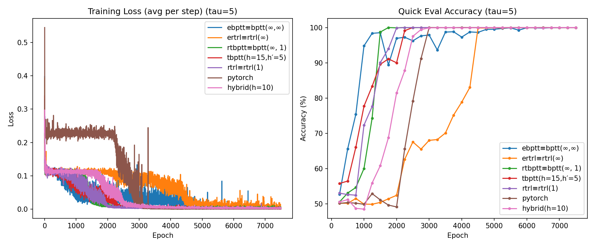
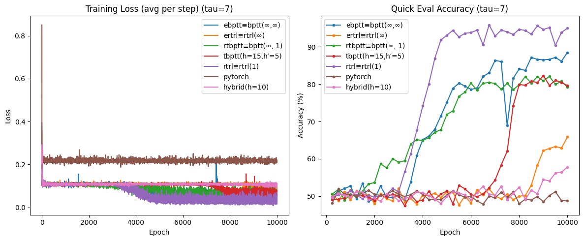
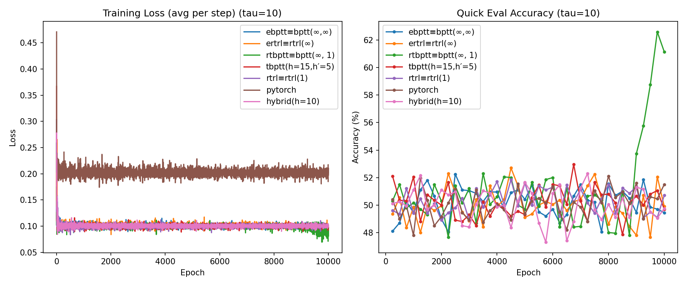

# 1. RNN

## Papers

- [R. J. Williams and D. Zipser, “A Learning Algorithm for Continually Running Fully Recurrent Neural Networks,” Neural Computation, vol. 1, no. 2, pp. 270–280, 1989.](./papers/1.1.pdf)
- [R. J. Williams and D. Zipser, “Gradient-Based Learning Algorithms for Recurrent Networks and Their Computational Complexity,” in Backpropagation: Theory, Architectures, and Applications, Y. Chauvin and D. E. Rumelhart, Eds. Hillsdale, NJ: Lawrence Erlbaum Associates, 1995, pp. 433–486.](./papers/1.2.pdf)

## Definitions & Forward Pass

General forward pass through the network structure is defined as follows.

!!! definition "Definition 1.1 : General Forward Pass"
    - **External inputs** at time $t$ : $x^{\text{in}}(t)\in\mathbb{R}^m$
    - **Unit outputs** at time $t$ : $y(t)\in\mathbb{R}^n$
    - **Augmented input vector** at time $t$ : $x(t)\in\mathbb{R}^{m+n}$

        $$
        x_k(t)= \begin{cases}x_k^{\text {in }} & \text { if } k \in I \\ y_k(t) & \text { if } k \in U\end{cases}
        $$

        $x(t)$ is a concatenation of inputs $x^{\text{in}}(t)$ and outputs $y(t)$, where $U$ is the indices for $y_k(t)$, and $I$ is the indices for $x^{\text{in}}(t)$.
        We use the convention that $x_k(t)$ and $y_k(t)$ correspond to the same unit when $k\in U$.

    - **Weight matrix** : $W\in\mathbb{R}^{n\times(m+n)}$, Entry $w_{kl}$ connects $x_l(t)$ to unit $k$.
    - Pre-activation **net input** at time $t+1$ : $s(t+1)\in\mathbb{R}^n$

        $$
        \begin{equation*}
        s_{k}(t+1)=\sum_{l \in U} w_{k l} y_{l}(t)+\sum_{l \in I} w_{k l} x_{l}^{\text {in }}(t)=\sum_{l \in U \cup I} w_{k l} x_{l}(t)
        \end{equation*}
        $$
    - **Updated unit outputs** at time $t+1$ : $y(t+1)\in\mathbb{R}^n$

        $$
        \begin{equation*}
        y_{k}(t+1)=f_{k}\left(s_{k}(t+1)\right)
        \end{equation*}
        $$

{: .center style="width:100%;"}
/// caption
Figure 1.1 : Forward pass diagram.
///

Note that all connections are treated as having a **one-time-step delay**: inputs at time $t$ can influence outputs only at $t+1$.

Assuming our task is sequential supervised learning task, we define the network error as follows.

!!! definition "Definition 1.2 : Network Error"
    - **Error for unit $k$** at time $t$ : $e_{k}(t)$

        Let $T(t)$ denote the set of indices $k \in U$ for which there exists a specified target value $d_{k}(t)$ that the output of the $k$ th unit should match at time $t$.

        $$
        e_{k}(t)= \begin{cases}d_{k}(t)-y_{k}(t) & \text { if } k \in T(t) \\ 0 & \text { otherwise }\end{cases}
        $$

    - **Negative overall network error** at time $t$ : $J(t)$
        
        $$
        \begin{equation*}
        J(t)=-\frac{1}{2} \sum_{k \in U}\left[e_{k}(t)\right]^{2}
        \end{equation*}
        $$

Our goal is to maximize the negative total error $J^{\text {total }}\left(t^{\prime}, t\right)$, 

$$
\begin{equation*}
J^{\text {total }}\left(t^{\prime}, t\right)=\sum_{\tau=t^{\prime}+1}^{t} J(\tau)
\end{equation*}
$$

One natural way to make the weight changes is along a constant positive multiple of the performance measure gradient, so that

$$
\begin{equation*}
\Delta w_{i j}=\eta \frac{\partial J^{\operatorname{total}}\left(t^{\prime}, t\right)}{\partial w_{i j}}
\end{equation*}
$$

## Gradient Computation

### Back Propagation Through Time

When we unroll the recurrent network through time, we obtain a feedforward network which has a layer for each time step.
Note that each unit and connection in the orignal network has a copy in each layer in the unrolled network.
The key value of this conceptualization is that it allows one to regard the problem of training a recurrent network as a corresponding problem of training a feedforward network with certain constraints imposed on its weights.

{: .center style="width:40%;"}
/// caption
Figure 1.2 : Unrolled recurrent network across time steps.
///

This also means that we can perform standard back propagation algorithm for feedforward nets in recurrent networks.
We introduce a general form of back propagation through time (bptt), $BPTT(h; h')$.

!!! definition "Definition 1.3 : General Back Propagation Through Time"
    
    $$BPTT(h; h')$$

    - **Unroll length** : $h$

        When we calculate the gradient at time $t$, we only consider the last $h$ time steps, $[t-h+1, h]$, ignoring the contributions before $t-h+1$.

        This factor controls the truncation length.
        When $h=\infty$, we maintain the full history of the network, and thus we compute the exact gradient.
        Meanwhile, when $h < \infty$, since we truncate the history, we

    - **Update period** : $h'$

        We do not calculate the gradient every time, we compute the truncated gradient and update weights every $h'$ steps.

        This factor is for epochwise gradient computation.
        Also, it means that our objective is to maximize $J^{\text{total}}(t-h'+1,t)$.

!!! concept "Concept 1.4 : Base BPTT Equations"
    For any differentiable objective $F$ that depends on outputs over an interval $(t',t]$, define

    $$
    e_k(\tau;F)=\frac{\partial F}{\partial y_k(\tau)},\qquad
    \delta_k(\tau;F)=\frac{\partial F}{\partial s_k(\tau)}.
    $$

    They satisfy the backward recurrences (with $\tau$ stepping down from $t$ to $t_0$)

    $$
    e_k(\tau;F)=
    \begin{cases}
    \frac{\partial F}{\partial y_k(t)}, & \tau=t, \\
    \frac{\partial F}{\partial y_k(\tau)}+\displaystyle\sum_{\ell\in U} w_{\ell k}\delta_\ell(\tau+1;F), & \tau<t,
    \end{cases}
    $$

    $$
    \delta_k(\tau;F)=f'_k\big(s_k(\tau)\big)e_k(\tau;F).
    $$

    The weight-gradient then collects contributions from each unrolled step:

    $$
    \frac{\partial F}{\partial w_{ij}}=\sum_{\tau=t_0}^{t-1}\delta_i(\tau+1;F)x_j(\tau)
    $$

!!! concept "Concept 1.5 : $BPTT(h; h')$ Equations"
    At an update time $t$ (performed once every $h'$ steps), $BPTT(h; h')$:

    1. Chooses the epoch objective
    
        $$
        F = J^{\text{total}}(t-h'+1,t)=\sum_{\tau=t-h'+1}^{t} J(\tau),
        $$

    2. Backpropagates only through the last $h$ steps, i.e. it computes **Concept 1.4** but restricts the recursion to $\tau\in[t-h+1,t]$ and ignores contributions earlier than $t-h$.
    Also, we only consider the error terms that occur in $[t-h'+1, t]$

        $$
        e_k(\tau;J^{\text{total}})=
        \begin{cases}
        \displaystyle \frac{\partial J(t)}{\partial y_k(t)}, & \tau=t \\
        \displaystyle \frac{\partial J(\tau)}{\partial y_k(\tau)}+\sum_{\ell\in U} w_{\ell k}\delta_\ell(\tau+1;J^{\text{total}}), & t-h'+1\le \tau < t \\
        \displaystyle \sum_{\ell\in U} w_{\ell k}\delta_\ell(\tau+1;J^{\text{total}}), & t-h+1 \le \tau < t-h'+1 \\
        0, & \tau < t-h+1
        \end{cases}
        $$

        $$
        \delta_k(\tau,J^{\text{total}})=
        \begin{cases}
        f'_k\big(s_k(\tau)\big)e_k(\tau;J^{\text{total}}), & \tau\ge t-h+1 \\
        0, & \tau<t-h+1
        \end{cases}
        $$
    
    3. Uses the truncated sum:

        $$
        \frac{\partial J^{\text{total}}(t-h'+1,t)}{\partial w_{ij}}
        \approx\sum_{\tau=t-h}^{t-1}\delta_i\big(\tau+1;J^{\text{total}}(t-h'+1,t)\big)x_j(\tau)
        $$

        (the approximation is precisely the truncation to the interval $[t-h, t]$).
    
To summarize, $BPTT(h; h')$ maximizes $J^{\text{total}}(t-h'+1,t)$ by back propagating through the last $h$ timesteps, using only the error terms occuring in the last $h'$ timesteps.

{: .center style="width:50%;"}
/// caption
Figure 1.3 : Truncated BPTT window over the unrolled sequence.
///

---

By controlling parameters $h$ and $h'$, we can acheive various forms of BPTT.

!!! definition "Definition 1.6 : Real-Time BPTT"

    $$BPTT(\infty, 1)$$

    **Real-Time BPTT** computes gradient for each timestep ($h'=1$), while back propagating through full history ($h=\infty$), which achieves real time exact gradient computation.

    {: .center style="width:40%;"}
    /// caption
    Figure 1.4 : Real-time BPTT with full-history backprop each step.
    ///

!!! definition "Definition 1.7 : Epochwise BPTT"
    
    $$BPTT(\infty, \infty)$$

    **Epochwise BPTT** run forward over an interval $[t_0, t_1]$, then do one backprop pass over the entire interval, updating once per epoch.

    {: .center style="width:40%;"}
    /// caption
    Figure 1.5 : Epochwise BPTT backpropagating over the full sequence.
    ///

!!! definition "Definition 1.8 : Truncated Real-Time BPTT"
    
    $$BPTT(h, 1)$$

    **Truncated Real-Time BPTT** is the same as real-time bptt (**Definition 1.6**) but backprop only through the last $h$ steps.

!!! definition "Definition 1.9 : Truncated Epochwise BPTT"

    $$BPTT(h, \infty)$$

    **Truncated Epochwise BPTT** is the same as epochwise bptt (**Definition 1.7**) but run an epoch, then backprop only $h$ steps from the end.
    
### Real-Time Recurrent Learning

!!! definition "Definition 1.10 : Real-Time Recurrent Learning"
    For each $k \in U, i \in U, j \in U \cup I$, and $t_{0} \leq t \leq t_{1}$, we define

    $$
    p_{i j}^{k}(t)=\frac{\partial y_{k}(t)}{\partial w_{i j}}
    $$
    
    From chain rule and differentation of **Definition 1.1** and **Definition 1.2**, we find that
        
    $$
    \frac{\partial J(t)}{\partial w_{i j}}=\sum_{k \in U} e_{k}(t) p_{i j}^{k}(t)
    $$

    $$
    p_{i j}^{k}(t+1)=f_{k}^{\prime}\left(s_{k}(t+1)\right)\left[\sum_{l \in U} w_{k l} p_{i j}^{l}(t)+\delta_{i k} x_{j}(t)\right]
    $$

    with the initial condition

    $$
    p_{i j}^{k}\left(t_{0}\right)=\frac{\partial y_{k}\left(t_{0}\right)}{\partial w_{i j}}=0.
    $$
    
    Using the recurrence formula of $p_{i j}^{k}(t)$, we can compute the gradient $\frac{\partial J(t)}{\partial w_{i j}}$ in real time.

Unlike back propagation through time, real time recurrent learning allows gradient computation in the same direction as the forward pass, without maintaining specific history of the network.

We have to compute and maintain the sensitivity matrix $p_{i j}^{k}(t)$, which yields a space complexity of $\Theta(n^3)$ and a time complexity of $\Theta(n^4)$.
The paper introduces a hybrid algorithm with BPTT and RTRL mixed together, which shows $\Theta(n^2)$ time per step, which is asymptotically better than real-time RTRL’s $\Theta(n^4)$ time.

## Teacher Forcing

!!! definition "Definition 1.11 : Teacher Forcing"
    During **teacher forced** training, whenever a target exists for unit $k$ at time $t$ (i.e., $k\in T(t)$), the network feeds the target back in place of the unit’s own output for all subsequent computations at that time step.

    $$
    x_k(t)=
    \begin{cases}
    x^{\text{in}}_k(t), & k\in I,\\
    d_k(t), & k\in T(t),\\\
    y_k(t), & k\in U\setminus T(t).
    \end{cases}
    $$

In BPTT, we cut off the error flow from future timesteps into the teacher forced node, and uses only the direct loss term at that step.
Thus **Concept 1.5** changes to

$$
e_k(\tau;J^{\text{total}})=\displaystyle \frac{\partial J(t)}{\partial y_k(t)}, \quad k \in T(\tau)
$$

In RTRL, we treat the value of $p_{i j}^{l}(t)$ as zero for any $l \in T(t)$ when computing $p_{i j}^{k}(t +1)$ via **Definition 1.10**.

$$
\begin{equation*}
p_{i j}^{k}(t+1)=f_{k}^{\prime}\left(s_{k}(t)\right)\left[\sum_{l \in U \backslash T(t)} w_{k l} p_{i j}^{l}(t)+\delta_{i k} x_{j}(t)\right]
\end{equation*}
$$

!!! concept "Concept 1.12 : Pros and Cons of Teacher Forcing"
    **Pros**

    - Speeds up and stabilizes training (less compounding of self-generated errors).
    - Keeps trajectories on-target in continual/oscillatory tasks (helps learn correct phase/dynamics).
    - Efficient in continually operating nets, since teacher forcing injects truth states to keep trajectories on track, so gradients carry the right information.

    **Cons**

    - Train/test mismatch: model is fed ground truth during training but not at inference → weaker free-running behavior (“exposure bias”).
    - Can mask error-recovery skills (model learns less about fixing its own mistakes).
    - Cuts some gradient paths (through forced units), which can under-train long temporal dependencies if overused.


## Implementation

### 1. PTB Dataset Prediction with RNN

<div style="text-align:center" markdown>
[Link to Code](https://github.com/arnold518/ai-study/tree/main/paper-review/1/1)
</div>

!!! definition "Definition 1.13 : Pytorch RNN"
    
    <div style="text-align:center" markdown>
    [Pytorch RNN Reference](https://docs.pytorch.org/docs/stable/generated/torch.nn.RNN.html)
    </div>

    $$
    h_t = \tanh (x_t W_{ih}^T + b_{ih} + h_{t-1} W_{hh}^T + b_{hh})
    $$

    ($h_t$ is the hidden state at time $t$, $x_t$ is the input at time $t$, $h_{t-1}$ is the hidden state of the previous layer at time $t-1$ or the initial hidden state at time $0$.)

    Parameters :

    - `input_size` : $H_{in}$, the dimension of input $x_t$.
    - `hidden_size` : $H_{out}$, the dimension of hidden state $h_t$.
    - `num_layers` : $K$, the number of recurrent layers, setting 2 layers mean stacking two RNNs together to form a stacked RNN, with the second RNN taking the outputs of the first RNN and computing the final results.

    Other parameters (given when inputs are given) : 

    - `sequence_length` : $L$, the sequence length of input $x_t$.
    - `batch_size` : $N$, the batch size of input.

    Inputs : 
    
    - `input` : $x_t$, tensor of shape $(L, N, H_{in})$ containing the features of the input sequence.
    - `hx` : $h_0$, tensor of shape $(K, H_{out})$, containing the initial hidden state.

    Outputs : 

    - `output` : $h_t$, tensor of shape $(L, N, H_{out})$ containing the output features from the last layer of the RNN, for each $t$.
    - `h_n` : $h_L$, tensor of shape $(K, N, H_{out})$ containing the final hidden state for each element in the batch.

    Variables :

    - `weight_ih_l[k]` : input-hidden weights of the $k$th layer, of shape $(H_{out}, H_{in})$ for $k=0$, $(H_{out}, H_{out})$ for $k>0$.
    - `weight_hh_l[k]` : hidden-hidden weights of the $k$th layer, of shape $(H_{out}, H_{out})$.
    - `bias_ih_l[k]` : input-hidden bias of the $k$th layer, of shape $(H_{out})$.
    - `bias_hh_l[k]` : hidden-hidden bias of the $k$th layer, of shape $(H_{out})$.

In order to predict the next word in the PTB dataset with RNN, we constructed an `embedding - rnn - linear` structured model.
First, we transformed each word into a feature vector using the embedding layer.
Secondly, after passing the sequence of feature vectors to the rnn layer, finally we used a linear layer to transform the results into a probability distribution to predict the following word.
Naturally, we used cross entropy loss for training.

``` py
# --- 4. RNN Model ---
class RNNModel(nn.Module):
    """Minimal RNN LM: Embedding → RNN → Linear-to-Vocab.
    
    Forward expects:
      tokens : [sequence_length, batch_size]
      h_0    : [num_layers,     batch_size, hidden_size] or None
    Returns:
      logits : [sequence_length, batch_size, vocab_size]
      h_N    : [num_layers,     batch_size, hidden_size]
    """
    def __init__(self, dict_size, embedding_size, hidden_size, num_layers):
        super().__init__()
        self.embedding = nn.Embedding(dict_size, embedding_size)
        self.rnn = nn.RNN(embedding_size, hidden_size, num_layers=num_layers)
        self.linear = nn.Linear(hidden_size, dict_size)

    def forward(self, x, h):
        """
        tokens   : [sequence_length, batch_size]
        h        : [num_layers, batch_size, hidden_size]
        embedded : [sequence_length, batch_size, embedding_size]
        out      : [sequence_length, batch_size, hidden_size]
        logits   : [sequence_length, batch_size, vocab_size]
        """
        emb = self.embedding(x)            # [seq_len, B, E]
        out, h = self.rnn(emb, h)          # out: [seq_len, B, H]
        logits = self.linear(out)          # [seq_len, B, V]
        return logits, h
```

!!! code "Code 1.1.1.py : Unstatefull TBPTT using Pytorch RNN"
    ``` py
    # --- 3. Dataset Class ---
    class PTBSequenceDataset:
        """Slice a long 1D corpus into (input, target) pairs of fixed sequence length."""
        def __init__(self, corpus, sequence_length):
            self.corpus = corpus
            self.seq_len = sequence_length

        def __len__(self):
            return len(self.corpus) - self.seq_len

        def __getitem__(self, idx):
            inputs = self.corpus[idx : idx + self.seq_len]
            targets = self.corpus[idx + 1 : idx + self.seq_len + 1]
            return inputs, targets

    # --- 5. Setup ---
    sequence_length = 35

    train_set = PTBSequenceDataset(train_corpus[:100000], sequence_length)
    test_set = PTBSequenceDataset(test_corpus, sequence_length)

    train_loader = DataLoader(train_set, batch_size=batch_size, shuffle=True)
    test_loader = DataLoader(test_set, batch_size=batch_size, shuffle=False)
    ```

    For the training of the model with pytorch rnn, we first used the usual dataloader for the PTB dataset with `shuffle=True`.
    Since it is inefficient to put the whole dataset into the RNN model, and perform full backpropagation on it, we cut the sequence into sequences of length $L$, and performed truncated bptt ($bptt(L, L)$).

    This resulted in unstateful training, where the whole sequence is cut into pieces of length $L$, but the computed hidden state from a former piece is not propagated into the following piece.
    In other words, it could not remember the information that was given before $L$ timesteps.

    This resulted in almost zero learning, and final test accuracy of 5.31%.

    {: .center style="width:100%;"}
    /// caption
    Figure 1.6 : Unstateful TBPTT training curve with weak learning.
    ///

!!! code "Code 1.1.2.py : Stateful TBPTT with Pytorch RNN"
    
    ``` py
    # --- 3) Stream batching into [T, B] ---
    def batchify(data_1d, batch_size, device):
        """
        Reshape a 1D token stream into [T, B] where B=batch_size parallel streams.
        Trims the tail so T*B divides the length exactly.
        """
        n_batches = data_1d.size(0) // batch_size
        data_1d = data_1d.narrow(0, 0, n_batches * batch_size)
        data_tb = data_1d.view(batch_size, -1).t().contiguous()  # [T, B]
        return data_tb.to(device)

    # --- 4) TBPTT windowing via IterableDataset (stateful order preserved) ---
    class StreamBatchDataset(IterableDataset):
        """
        Iterates over a time-major source tensor [T, batch_size] and yields
        (data_window, target_window) pairs for TBPTT:
        data_window   : [seq_len, batch_size]
        target_window : [seq_len * batch_size]  (flattened next-token labels)
        NOTE: Order is sequential; do NOT shuffle if you want stateful training.
        """
        def __init__(self, source_tb: torch.Tensor, sequence_length: int):
            super().__init__()
            self.source = source_tb
            self.seq_len = sequence_length

        def __iter__(self):
            T = self.source.size(0)
            for i in range(0, T - 1, self.seq_len):
                cur_len = min(self.seq_len, (T - 1) - i)
                data = self.source[i : i + cur_len]                   # [cur_len, B]
                target = self.source[i + 1 : i + 1 + cur_len]         # [cur_len, B]
                yield data, target.reshape(-1)                         # [cur_len*B]

    # --- 6) Hyperparameters & tensors ---
    sequence_length = 35
    # Create iterable datasets that yield TBPTT windows sequentially
    train_ds = StreamBatchDataset(train_tb, sequence_length)
    test_ds  = StreamBatchDataset(test_tb,  sequence_length)

    # DataLoaders: keep order, no auto-batching (each dataset item is already a batch window)
    # num_workers=0 is safest when source tensors live on GPU
    train_loader = DataLoader(train_ds, batch_size=None, shuffle=False, num_workers=0)
    test_loader  = DataLoader(test_ds,  batch_size=None, shuffle=False, num_workers=0
    ```

    For stateful training, we used iterable datasets.
    First, cut the whole sequence evenly into $N$ pieces for each batch.
    Then, for each batch, we created datasets by cutting each subsequence into continual pieces of length $L$.
    This way, for each batch we can propagate the hidden state of the former piece into the following piece.

    Note that even in truncated BPTT, the forward pass should be propagated, while the backward error pass can be truncated.

    This resulted in a difference with **Code 1.1.1.py**, with final test accuracy of 23.66%.

    {: .center style="width:100%;"}
    /// caption
    Figure 1.7 : Stateful TBPTT training curve with improved accuracy.
    ///

!!! code "Code 1.1.3.py : Handmade RNN"
    Replaced the pytorch RNN with handmade `class MinimalRNNCell(nn.Module)` and `class MinimalRNN(nn.Module)`.

    Showed almost same results as **Code 1.1.2.py**

### 2. Solving Delayed XOR Task with Various RNN Algorithms

<div style="text-align:center" markdown>
[Link to Code](https://github.com/arnold518/ai-study/tree/main/paper-review/1/2)
</div>

There is a major difference in the forward pass described in the paper (**Definition 1.1**, **Definition 1.2**) with Pytorch's forward pass (**Definition 1.13**), because of the one timestep delay in **Definition 1.1**.
Thus, we introduce a universal convention that is based mostly on the paper, but can be interpreted in both situations.

!!! definition "Definition 1.14 : Universal Forward Pass Convention"
    Paper (**Definition 1.1**, **Definition 1.2**)

    - Forward pass : 
        $x(t) = [x^{\text{in}}(t), y(t)], s(t+1)=Wx(t), y(t+1)=f(s(t+1))$
    - Supervision (targets) :
        At timestep $t$, we supervise $y(t+1)$ with $d(t+1)$, which was produced after consuming $x(t)$.

    Pytorch (**Definition 1.13**)

    - Forward pass :
        $h_t= \text{RNN}(x_t, h_{t-1})$
    - Supervision (targets) :
        At timestep $t$, we supervise $h_t$, which was produced after consuming $x_t$.
    - Alignment to the paper :
        Identify $h_t \equiv y(t+1), x_t \equiv x^{\text{in}}(t)$

    **Universal Convention**

    - Forward pass :
        `x_list[t]` $\equiv x(t)$, `s_list[t]` $\equiv s(t+1)$, `y_list[t]`$\equiv y(t+1)$  
        ($x(t), s(t+1), y(t+1)$ is defined as the paper)
    - Supervision (targets) : 
        `D[t]` $\equiv d(t+1)$, At timestep $t$, we compare `y_list[t]` to `D[t]`, i.e. $y(t+1)$ to $d(t+1)$.

    <div style="text-align:center" markdown>

    | Concept                  | Paper               | PyTorch           | Universal Convention           |
    | ------------------------ | ------------------- | ----------------- | ------------------------------ |
    | External input used      | $x^{\text{in}}(t)$  | `input[t]`$=x_t$  | `x_list[t][:m]`                |
    | Concatenated input       | $x(t)$              | — (implicit)     | `x_list[t] = [x_in(t), y(t)]` |
    | Pre-activation           | $s(t+1)$            | — (inside cell)  | `s_list[t]`                    |
    | Output/hidden            | $y(t+1)$            | `output[t]`$=h_t$ | `y_list[t] = x_list[t+1][m:]`                    |
    | Previous state           | $y(t)$              | `output[t-1]`$=h_{t-1}$ | `x_list[t][m:]`      |
    | Target at timestep $t$   | $d(t+1)$            | `answer[t]`       | `D[t]`                         |

    </div>


Using the universal forward pass convention (**Definition 1.14**), we implemented and compared various algorithms of gradient computation in RNNs.
We tackled the delayed XOR task, where for time $t$ two input cells carry randomly sampled bits, and the output at time $t+\tau$, one output cell must match the xor of the two bits at time $t$.

!!! code "Code 1.2"
    - `alg_pytorch.py` : 
        Used a single layer pytorch rnn module described in **Definition 1.13**, modified to match **Definition 1.14**.
    - `alg_bptt.py` : 
        Implemented $BPTT(h, h')$ described in **Definition 1.3** and **Concept 1.5**.
        Achieved variants of the bptt algorithm by changing the parameters, $h$ and $h'$.

        - ebptt $\equiv BPTT(\infty, \infty)$ : Epochwise BPTT defined in **Definition 1.7**.
        - rtbptt $\equiv BPTT(\infty, 1)$ : Real-Time BPTT defined in **Definition 1.6**.
        - tbptt $\equiv BPTT(h, h')$ : general truncated BPTT.
    - `alg_rtrl.py` : 
        Implemented RTRL described in **Definition 1.10**.
        For analogy with BPTT, introduced $RTRL(h')$, where we update the gradient every $h'$ timesteps.

        - ertrl $\equiv RTRL(\infty)$ : Epochwise RTRL, update gradient after consuming an epoch.
        - rtrl $\equiv RTRL(1)$ : update gradient every timestep.
    - `alg_hybrid.py` : 
        Implemented the hybrid algorithm with BPTT and RTRL mixed together, as introduced in the paper.
    - `core.py` :
        File for dataclass definitions.
    - `helper.py` : 
        File containing activation functions, their derivatives, delayed xor testbench, and scorers.
    - `main.py` : 
        Main runner file, controls parameters, creates testdata, and runs the test on all algorithms.
    
    Test was done with the following parameters :

    ``` py
    results = run_many(
        alg_names=["ebptt", "ertrl", "rtbptt", "tbptt", "rtrl", "pytorch", "hybrid"],
        m=2, n=8, lr=5e-3,
        tau=7, Ttrain=50, Teval=50,
        eval_seqs=200, quick_eval_seqs=50,
        epochs=7500, log_every=250,
        weight_decay=0.0,
        truncation_h=15, update_every_hprime=5,   # used only by tbptt
        rtrl_hprime=1,                            # used only by rtrl (continual)
        h_bucket=10,                              # used only by hybrid
        grad_clip=None,
        seed=0,
        metric_name="acc", metric_threshold=0.5,
    )
    ```

{: .center style="width:100%;"}
/// caption
Figure 1.8 : Delayed XOR accuracy at tau=5.
///

{: .center style="width:100%;"}
/// caption
Figure 1.9 : Delayed XOR accuracy at tau=7.
///

{: .center style="width:100%;"}
/// caption
Figure 1.10 : Delayed XOR accuracy at tau=10.
///

In the result, all algorithms showed 100% success when $\tau=5$, but they showed less and less accuracy when $\tau$ got larger.
When $\tau=10$, almost all algorithms failed to learn any meaningful informations from the data.

This result shows that RNN are weak on remembering informations with large timesteps involved, it has a short short-term memory.
This fatal issue will be improved through LSTMs, or GRUs later.
